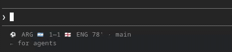

<div align="center">

# ⚽ claudial

### Live World Cup 2026 in your terminal — goal and red-card takeovers included

One command. Every World Cup score, in your terminal and right inside Claude
Code, while you work.

```
npm install -g claudial && claudial setup
```

<br/>

[](https://www.npmjs.com/package/claudial)
[](https://www.npmjs.com/package/claudial)
[](https://nodejs.org)
[](LICENSE)
[](tsconfig.json)
[](https://github.com/lefProg/claudial/stargazers)
[](https://github.com/lefProg/claudial/issues)

</div>

---

Live World Cup scores right inside Claude Code's status bar — under the input
box, always visible while you work, lighting up the moment anyone scores:

<div align="center">



</div>

## Claude Code, World Cup edition

The whole point: your Claude Code, score-aware. One command and the live score
sits right in Claude Code's status bar — under the input box, always visible
while Claude works, with nothing to wire up by hand.

```bash
npm install -g claudial
claudial setup
```

The wizard drops a live-score statusline into your Claude Code settings:

```
⚽ QAT 🇶🇦 0—1 🇨🇭 SUI 67' · main          ← during a match
○ QAT 🇶🇦 — 🇨🇭 SUI 10:00 PM · main        ← between matches (next kickoff, or last result)
⚽ G O O O L  ·  ARG 🇦🇷 1—0 🇲🇽 MEX        ← for 15s whenever anyone scores
🟥 R E D  ·  OTAMENDI  ·  ARG 🇦🇷 — 🇲🇽 MEX  ← for 15s on a red card
```

It refreshes every few seconds and is pure Node, so it runs on macOS and
Windows too, in any shell. Restart Claude Code after setup to see it.
Scriptable, no prompts: `claudial setup --statusline --global --yes`.

**Already run a custom status line?** `claudial setup` keeps it — it wraps your
existing one and appends the score, so nothing you had is lost.

## The full dashboard

Prefer the full board beside Claude? `claudial` opens a live dashboard — every
match with scores, minutes and scorers, upcoming fixtures in your local time,
all auto-refreshing while you work. And when a goal goes in — anywhere in the
tournament — the whole screen takes over:

```


      █▀▀█  █▀▀█  █▀▀█  █
      █ ▄▄  █  █  █▀▀█  █
      ▀▀▀▀  ▀▀▀▀  ▀  ▀  ▀▀▀▀

         LIONEL MESSI · 23'

      ARG 🇦🇷  2 — 1  🇲🇽 MEX


```

Four seconds of glory, then back to the board. It costs nothing to glance at,
and celebrates louder than a push notification — without you ever opening a
browser tab.

## Usage

```
npx claudial            # the dashboard
npx claudial --ticker   # 4-line strip for slim split panes
npx claudial | cat      # non-interactive snapshot (pipes, scripts, CI)
```

Or install it for good:

```
npm install -g claudial
claudial
```

Requires Node ≥ 18. No account, no API key, no config.

| Key | Action      |
|-----|-------------|
| `r` | refresh now |
| `q` | quit        |

Beyond goals, every live match carries its incident feed — yellow cards,
substitutions, injury time — and red cards get the full-screen treatment, same
as goals.

## Status

v1 is being built live during the group stage. Follow the commits.

## Notes

- Seeing letter codes instead of country flags (`🇦🇷` showing as `AR`)? Your
  terminal isn't rendering flag emoji. Install [Konsole](https://konsole.kde.org/)
  — it shows them out of the box. (macOS terminals already do; Windows
  Terminal does not.)
- Match data comes from [ESPN's public soccer scoreboard](https://site.api.espn.com/apis/site/v2/sports/soccer/fifa.world/scoreboard)
  — facts only (scores, scorers, cards), no logos or branding. See
  [DATA.md](DATA.md) for why this source. Not affiliated with or endorsed by
  ESPN or FIFA.
- Not affiliated with Anthropic. The aesthetic is a love letter to
  [Claude Code](https://claude.com/claude-code), whose terminal UI this
  proudly imitates.
- Polling is deliberately gentle (15 s live, 5 min fixtures), and a single
  scoreboard call serves all live matches at once. Please keep it that way.

```js
// Canada — Bosnia & Herzegovina, 12 June 2026, was on while this was built.
// Jovo Lukić's 21' goal was the first one this codebase ever saw — it showed
// up in a smoke test before any UI existed to celebrate it. Legendary.
```

## Contributing

Issues and PRs welcome — bug reports, new incident types, terminal quirks,
all of it. Keep the polling gentle and the spirit playful.

```bash
git clone https://github.com/lefProg/claudial.git
cd claudial
npm install
npm run dev     # live TUI from source
npm test        # vitest
```

## License

[MIT](LICENSE) © lefProg

<div align="center">

<br/>

**If this made a goal feel a little louder, drop a ⭐ — it helps others find it.**

[Report a bug](https://github.com/lefProg/claudial/issues) ·
[Request a feature](https://github.com/lefProg/claudial/issues) ·
[npm](https://www.npmjs.com/package/claudial)

</div>
