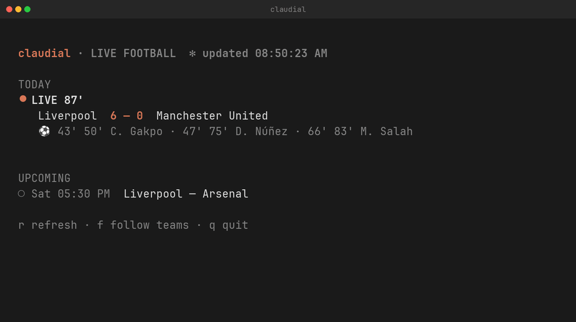

<div align="center">

# ⚽ claudial

### Live football inside Claude Code

Your teams' scores sit under your prompt while you code.
When one of them scores, your terminal celebrates.

```
npm install -g claudial && claudial setup
```

<br/>

[](https://www.npmjs.com/package/claudial)
[](https://www.npmjs.com/package/claudial)
[](https://nodejs.org)
[](tsconfig.json)

[](LICENSE)
[](https://github.com/lefProg/claudial/stargazers)

<br/>



**Premier League · La Liga · Serie A · Bundesliga · Ligue 1 · Champions League ·
Europa League · Conference League · Super League Greece · World Cup**

</div>

---

## Get started

| You are… | Run |
|---|---|
| **New to claudial** | `npm install -g claudial`<br>`claudial setup` |
| **Back from the World Cup** (you have 0.6.x) | `npm install -g claudial@latest`<br>`claudial --version` (should print 0.7.0 or newer)<br>`claudial follow` |

Then restart Claude Code. World Cup users keep their status line as it is; `claudial follow`
picks your leagues and teams, because the new version starts following nothing.

Still seeing "WORLD CUP 2026" after updating? An old copy comes first on your PATH.
`which -a claudial` lists every copy; remove the old one with
`npm uninstall -g --prefix <its folder> claudial` (e.g. `--prefix ~/.npm-global`).

## The score, right under your prompt

One command puts a live score line into Claude Code's status bar. It stays out
of the way while Claude works, and lights up the moment anyone scores:

<div align="center">


</div>

```
⚽ Liverpool 6—0 Manchester United 87' · main                      ← every match you follow
⚽ G O O O L  ·  Liverpool 7—0 Manchester United · main            ← for 15 s after a goal
🟥 R E D  ·  CASEMIRO  ·  Manchester United — Southampton · main   ← for 15 s after a red card
○ Liverpool — Arsenal Sat 05:30 PM · main                          ← between matches: next kickoff
```

Your git branch stays at the end. **Already run a custom status line?** Setup
keeps it and appends the score, so nothing you had is lost. Pure Node, so it
works on macOS, Linux and Windows. Restart Claude Code after setup to see it.

## Pick your teams in five seconds

Setup ends by asking what you follow. Type a name, tick it with space, press
esc to save:

```
 claudial · what do you follow?

 search › liver▏

 › ◉ Liverpool  LIV · Premier League

 Following Liverpool
 ↑↓ move · space follow · type to search · esc clear search · ctrl+c cancel
```

Follow a whole league or just your club. Change your mind any time: press `f`
in the dashboard, or run `claudial follow`.

## A goal takes over the whole screen

Want the full board beside Claude? `claudial` opens a live dashboard: every
match you follow with scores, minutes, scorers and cards, plus the next three
weeks of fixtures in your local time.

When a goal goes in, the server pushes it within a second, and the whole
screen becomes the goal: the scorer, the minute, the new score. Four seconds
of glory, then back to the board. Red cards get the same treatment.

## Usage

```
claudial              # the live dashboard
claudial --ticker     # a 4-line strip for slim split panes
claudial | cat        # plain snapshot for pipes and scripts
claudial follow       # pick leagues and teams
```

| Key | Action |
|-----|--------|
| `f` | pick what you follow |
| `r` | refresh now |
| `q` | quit |

Requires Node ≥ 18. No account, no sign-up, no API key.

Scripting it? `claudial setup --statusline --yes` installs without
prompts, and `claudial leagues`, `claudial teams <league>`,
`claudial follow <id>...`, `claudial unfollow <id>...` and `claudial following`
work without the UI. `claudial forget` deletes your device from the server.

## Status

claudial started as a World Cup 2026 side project. It now follows ten leagues
through its own server, written in Rust: one set of polls for everyone, goals
pushed to every terminal over server-sent events.

## Notes

- Privacy: the server stores a random device id, what you follow, and when it
  last saw you. No accounts, emails, names or analytics, and your IP is never
  written down. Inactive devices are deleted after 400 days; `claudial forget`
  deletes yours right away.
- Match facts (scores, scorers, cards) come from ESPN's public site API, through
  the claudial server. No logos or branding. Not affiliated with or endorsed by
  ESPN, FIFA, UEFA or any league.
- Seeing `AR` instead of `🇦🇷` for national teams? Your terminal doesn't render
  flag emoji. macOS terminals and [Konsole](https://konsole.kde.org/) do;
  Windows Terminal doesn't.
- Not affiliated with Anthropic. The look is a love letter to
  [Claude Code](https://claude.com/claude-code).

```js
// Canada — Bosnia & Herzegovina, 12 June 2026, was on while this was built.
// Jovo Lukić's 21' goal was the first one this codebase ever saw — it showed
// up in a smoke test before any UI existed to celebrate it. Legendary.
```

## Contributing

Issues and PRs welcome: bug reports, new incident types, terminal quirks, all
of it. Keep the spirit playful.

```bash
git clone https://github.com/lefProg/claudial.git
cd claudial
npm install
npm run dev     # live TUI from source
npm test        # vitest
```

## License

[MIT](LICENSE) © lefProg

<div align="center">

<br/>

**If this made a goal feel a little louder, drop a ⭐. It helps others find it.**

[Report a bug](https://github.com/lefProg/claudial/issues) ·
[Request a feature](https://github.com/lefProg/claudial/issues) ·
[npm](https://www.npmjs.com/package/claudial)

<br/>

**YNWA** 🔴

</div>
