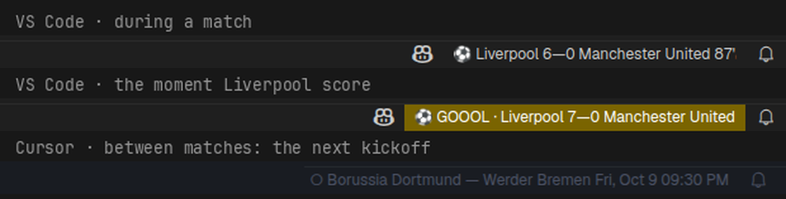

# ⚽ claudial: live football in your status bar

The scores of the teams you follow, at the bottom of your editor while you code.
When one of them scores, the status bar flashes.

Works in **VS Code, Cursor, Antigravity and Windsurf**.

## What you get

- **Live scores** for every match you follow: `⚽ Liverpool 6—0 Manchester United 87'`
- **Goals and red cards flash** for 15 seconds, the moment the server sees them:
  `⚽ GOOOL · Liverpool 7—0 Manchester United`
- **Between matches**, the next kickoff or the last result
- **Ten leagues:** Premier League, La Liga, Serie A, Bundesliga, Ligue 1, Champions
  League, Europa League, Conference League, Super League Greece, World Cup

## Pick your teams

Click the score (or run **claudial: Follow teams** from the command palette), type
"liverpool", tick it, press Enter. Follow whole leagues or single clubs.

Already use the [claudial CLI](https://www.npmjs.com/package/claudial)? The extension
shares its device, so the teams you follow there show up here too.

## Settings

| Setting | Default | What it does |
|---|---|---|
| `claudial.serverUrl` | empty | Use another claudial server. Empty means the public one. |

## Privacy

The server stores a random device id, what you follow, and when it last saw you. No
accounts, emails, names or analytics, and your IP is never written down. Inactive devices
are deleted after 400 days; `claudial forget` in the CLI deletes yours right away.

Match facts come from ESPN's public site API through the claudial server. Not affiliated
with ESPN, FIFA, UEFA or any league.

**YNWA** 🔴
